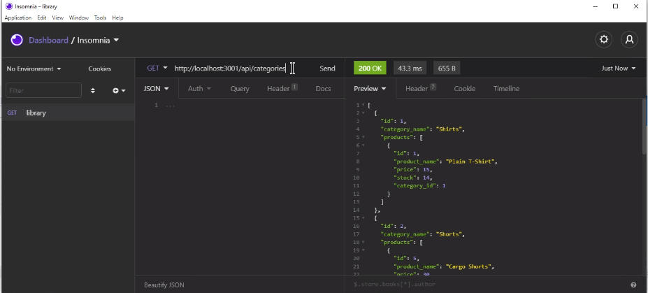

# ORM_eCommerce_Bank

ORM E-Commerce Back End development project using Express, MySQL, and Sequelize

---

## Description

The E-Commerce Bank allows the user to search for, update, create, and delete products, categories, and tags.

\

---

## Installation

In order to use the E-Commerce Bank application, you will need to follow the following steps:
**Note: make sure to have MySQL Workbench (or other SQL application) and Insomnia installed.**

1. Use Command Prompt or the VS terminal to install the needed npm node packags:
   - Run 'npm i' to pull down the npm package manager.
   - Run 'npm init -y' to install the package.json.
   - Run 'npm dotenv' to install the the env package to secure your database and password information.
   - Run 'npm sequelize' to install the Sequelize package.
   - Run 'npm mysql2' to install the MySQL package.
2. Update the .env file with database, username, password.
3. Open the main folder in Command prompt or the VS terminal.
4. Open MySQL Workbench and run the schema to create the needed database.
5. In Git Bash or VS terminal, run node seeds/index.js to create the tables and insert data.
6. Run 'npm start' in either the command prompt or VS terminal.
7. Open Insomnia and connect to the designated localhost.
8. Use the desingated routes to GET, POST, PUT, and DELETE different categories, products, and tags.

---

## Usage

This program can be used with permission.\
[Follow the link to watch the walkthrough video - part 1](https://drive.google.com/file/d/15g5d8qxMpaJv-QJMlwzxeKXRQx3euEAh/view)\
[Check out part 2 of the walkthrough video](https://drive.google.com/file/d/15g5d8qxMpaJv-QJMlwzxeKXRQx3euEAh/view)

---

## License

---

## Contact

If you have any questions, please contact me at:\
✉️[Email](mailto:hrkoren@gmail.com)\
📂[GitHub](https://github.com/hrkoren)
